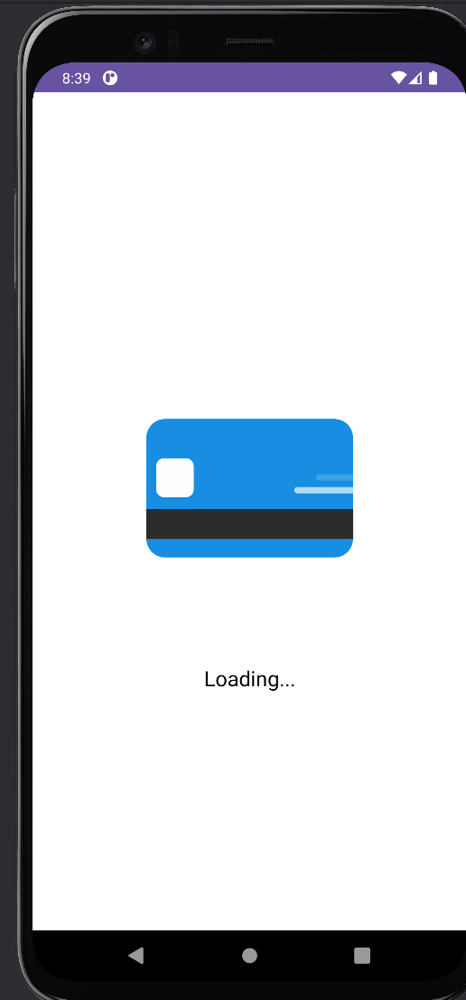
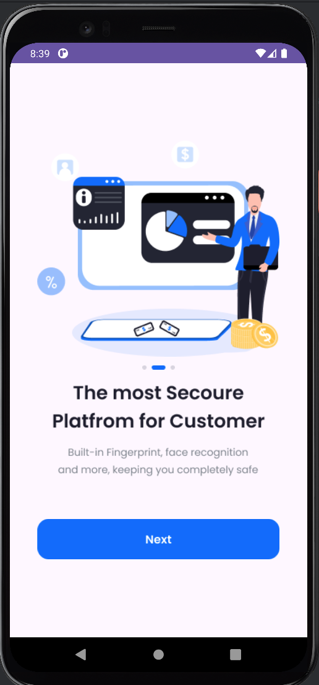
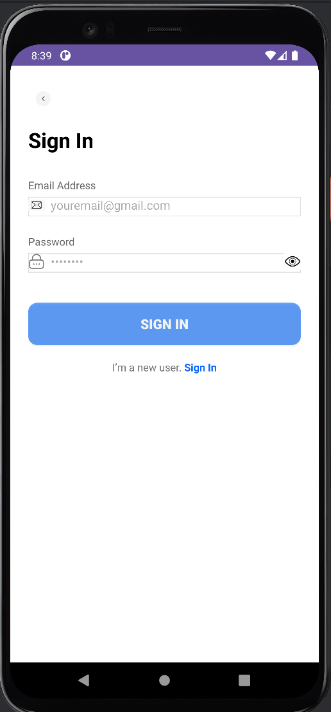
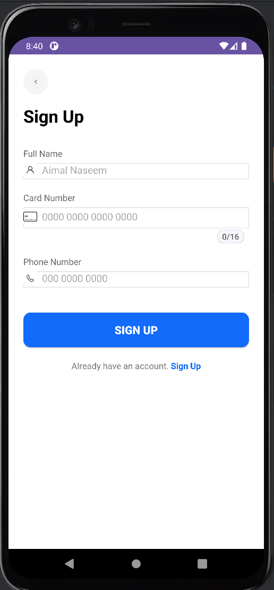
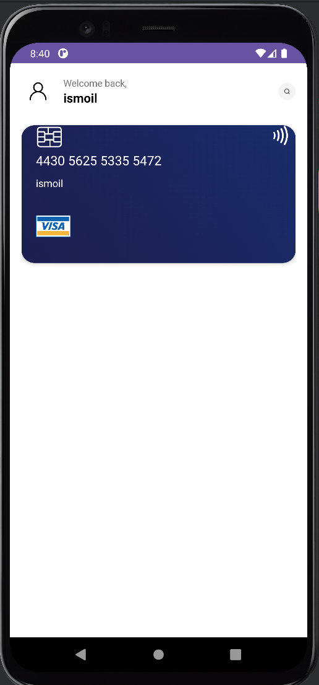

# 📱 Simple Android App (Onboarding, Sign-In, Home)

This project is a **simple Android demo app** built to practice key Android concepts such as
`EditText`, `TextWatcher`, `Intent`, and basic UI layouts.  
It includes onboarding screens, authentication pages, and a home screen.

---

## 🚀 Main Features

- 🧭 **Onboarding Screens** — Introduce new users to the app.
- 🔐 **Sign In / Sign Up** — User authentication screens.
- 🏠 **Home Screen** — Displays basic user information and UI components.
- ✍️ **EditText + TextWatcher** — Monitor text changes in real time.
- 🔄 **Intent** — Transfer data between different activities.
- 💾 **SharedPreferences** — Store simple user data locally.
- 🎨 **Material Design** — Clean, modern, and user-friendly interface.

---

## 🧠 Technologies Used

- **Android Studio**
- **Kotlin / Java**
- **XML Layouts**
- **TextWatcher**
- **Intent**
- **ConstraintLayout / LinearLayout**
- **Material Design Components**

---


<p align="center"> 


 
 

 
 </p>

## ⚙️ Installation

1. Clone the repository:
   ```bash
   git clone https://github.com/username/simple-android-app.git
